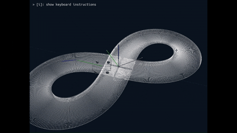

This project implements a Decision Transformer-based autonomous driving agent in the Genesis4D simulation environment.

# 🚗 Genesis4D + Decision Transformer 自動運転エージェント

このプロジェクトは、Genesis4D シミュレーション環境上で Decision Transformer を用いた
自動運転エージェントの学習と評価を行うものです。

## 📌 目的
- Transformerベースの強化学習手法を自動運転に応用する
- 世代進化を繰り返し、高度な運転知能を獲得できるかの検証
- シミュレーション環境で再現性ある検証

## 🧠 使用技術
- `Python` / `PyTorch` / `NumPy`
- `Decision Transformer`
- `Soft Actor-Critic`
- `ControlMLP`
- `Pure-Pursuit`
- `Genesis4D`（0.3.0.dev）

## 📁 Project Structure
      project/ 
         ├── evolution_trainer.py 
         ├── config/ 
         ├── models/ 
         ├── media/ 
         │   └── demo.gif 
         ├── README.md 
         └── genesis_env.yml

## 🚀 実行方法

`1. 環境を再現する`

`conda env create -n genesis_env_v2 -f genesis_env.yml`

`2. Genesis を手動で組み込む`

`conda activate genesis_env_v2`
`pip install -e C:\Users\my_user\Genesis4D`

`3. 実行する`

`evolution_trainer.py`

## 📄 License

This project is licensed under the MIT License.
